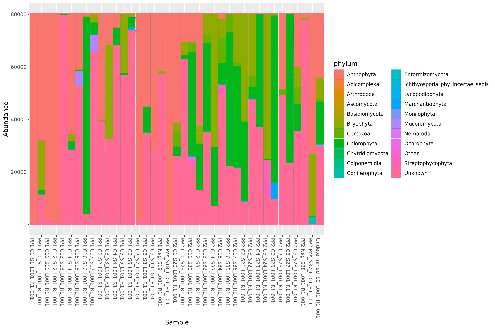

# DNAmetabarcoding
Identification and taxonomic classification of exact amplicon sequence variants (ASVs) from DNA metabarcoding data.

The DNAmetabarcoding program processes fastq-formatted DNA metabarcoding sequence data to produce a summary of the ASVs contained in each sample. It uses [cutadapt](https://cutadapt.readthedocs.io/en/stable/) to trim primers from the sequences and [DADA2](https://benjjneb.github.io/dada2/index.html) to identify and count abundance of the ASVs. It assigns taxonomy through either DADA2 or BLAST, depending on the user's request; and allows visualization of the resulting taxa for a user-defined set of samples.

## Table of Contents
* [Installation](#installation)
* [Quick Start](#quick-start)
  * [single sample](#analyze-a-single-sample)
  * [multiple samples](#analyze-multiple-samples)
  * [visualization](#create-an-abundance-plot)
* [Environment](#environment)
  * [Setting up your environment on Henry2](#setting-up-your-environment-on-henry2)
  * [The DNAmetabarcoding Conda environment](#the-dnametabarcoding-conda-environment)
* [The DNAmetabarcoding program](#the-dnametabarcoding-program)
  * [Primer trimming: cutadapt](#primer-trimming-cutadapt)
  * [ASV identification: DADA2](#asv-identification-dada2)
  * [Taxonomy: DADA2](#taxonomy-dada2)
  * [Taxonomy: BLAST + taxizedb](#taxonomy-blast-taxizedb)
* [Visualization](#visualization)
* [Databases](#databases)
  * [DADA2 taxonomy databases](#dada2-taxonomy-databases)
  * [NCBI nt BLAST database](#ncbi-nt-blast-database)
  * [Taxize NCBI database](#taxize-ncbi-database)
* [Data Storage and Retrieval](#data-storage-and-retrieval)
  * [Data storage on the HPC](#data-storage-on-the-hpc)
  * [Downloading data from the HPC](#downloading-data-from-the-hpc)

## Installation
To install the DNAmetabarcoding program, use the following command. This path can also be copied from the `Code` dropdown menu.
```bash
git clone https://github.com/jessicaparks/DNAmetabarcoding.git
```
This will download the code to a directory named `DNAmetabarcoding`. For authentication, it will ask for your GitHub username and password.

## Quick Start
Each of the following commands should be run from within the DNAmetabarcoding sub-directory. Before running any of these commands, you'll need to do the first step under [Setting up your environment on Henry2](#setting-up-your-environment-on-henry2) to install Conda.
#### Analyze a single sample:
Run the following command with the arguments substituted to match your data.
```bash
conda activate /usr/local/usrapps/trnL_blast/conda/envs/dnametabarcoding
./app.py -i INPUT_FASTQ_FILE -o OUTPUT_CSV_FILE --primers PRIMER_FASTA_FILE --taxmethod BLAST
```

#### Analyze multiple samples:
Edit the `submit_job.sh` script and run `./submit_job.sh` to send the jobs to the cluster.

#### Create an abundance plot:
Run the following command with the correct arguments for your data. This requires that the csv files that you wish to combine and visualize are in a directory together.
```bash
conda activate /usr/local/usrapps/trnL_blast/conda/envs/dnametabarcoding
./visualizations.py -d INPUT_DIRECTORY -o OUTPUT_DIRECTORY -p OUTPUT_FILE_PREFIX -r TAXONOMIC_RANK -f TOP_TAXA_FILTER
```

## Environment
The DNAmetabarcoding program includes an environment that is managed with [Conda](https://docs.conda.io/en/latest/). Instructions for working with and editing this environment are in the sections below.

### Setting up your environment on Henry2
The DNAmetabarcoding program uses a conda environment. To enable conda access on the HPC, you should run the following two commands and then log out and log back in. This will only need to be done once. For more details on conda setup on use on Henry2, see https://projects.ncsu.edu/hpc/Software/Apps.php?app=Conda.  
```bash
module load conda
conda init tcsh
```
You will need to complete this additional step (also detailed in the instructions at https://projects.ncsu.edu/hpc/Software/Apps.php?app=Conda) if you want to create or edit the Conda environment. Create a file in your home directory named `.condarc`, with the following contents:  
```bash
channels:
  - bioconda
  - conda-forge
  - defaults
envs_dirs:
  - /usr/local/usrapps/trnL_blast/conda/envs
pkgs_dirs:
  - /usr/local/usrapps/trnL_blast/conda/pkgs
report_errors: false
```
This will direct conda to store environments and packages at `/usr/local/usrapps/trnL_blast/conda/`. If you do not have this `.condarc` file, conda will attempt to store these files in your home directory, which has very limited space on the HPC. This will result in an error about running out of space.  

### The DNAmetabarcoding Conda environment
To list the existing conda environments, run this command:  
```bash
conda env list
```
To create the conda environment, you can run the following command:  
(This should either be run from the location of the `environment.yaml` file or use the path to that file.)  
```bash
conda env create -f environment.yaml
```
To update the conda environment, you can run this command:  
```bash
conda env update -f environment.yaml
```

## The DNAmetabarcoding program

### Primer trimming: cutadapt

### ASV identification: DADA2

### Taxonomy: DADA2

### Taxonomy: BLAST + taxizedb


## Visualization
The visualization portion of this program is provided as a separate script, `visualizations.py`, to allow users the flexibility to combine and visualize data from any set of samples. The samples to include are specified by providing the directory that contains the result CSV files (output by the `app.py` program) for these samples. To run the visualization for a custom set of samples, copy the result CSV files for those samples to a new directory. Note, all CSV files in the directory will be considered.

The documentation and help text for the visualization program can viewed by running `./visualizations.py --help`, which will produce a help message like that shown below.
```
Usage: visualizations.py [OPTIONS]

  Summarize the ASV abundance and taxonomy data and plot the abundance. The
  ASV abundance and taxonomy data from all of the CSV files in the input
  directory is merged by the ASV sequence.

  This will produce the following output files in the specified output
  directory: (1) a csv with all the taxonomy data, (2) a csv with all the
  abundance data, (3) a csv with the merged taxonomy and abundance data, (4)
  a csv with the filtered taxonomy data where the taxon of interest is
  replaced with "Other" for values below the cutoff rank abundance, and (5)
  a png-formated image file with the abundance plot.

  "Unknown" indicates taxonomy values that were not determined. "Other"
  indicates taxonomy values that are below the rank abundance cutoff, when
  considering cumulative abundance in all samples in the input directory.

  Note: This relies on the taxonomy determined for each of the samples being
  consistent for the same ASV sequence. If different methods (BLAST and
  DADA2) were used to determine the taxonomy, this likely will not be true
  and the resulting taxonomy summary will choose alphabetically the first
  taxonomic assignment for each ASV sequence.

Options:
  -d, --directory DIRECTORY       path for directory containing the input CSV
                                  files  [required]

  -o, --outputdir DIRECTORY       path for the output directory  [required]
  -p, --outputprefix TEXT         prefix for the output files  [required]
  -r, --rank [kingdom|phylum|class|order|family|genus|species]
                                  taxonomic rank to be visualized  [required]
  -f, --filter INTEGER            number of top taxa to display in
                                  visualization  [default: 10]

  --help                          Show this message and exit.
```

As indicated by the help message, the visualization code can be run as follows:
```bash
./visualizations.py -d INPUT_DIRECTORY -o OUTPUT_DIRECTORY -p OUTPUT_FILE_PREFIX -r TAXONOMIC_RANK -f TOP_TAXA_FILTER
```

The `INPUT_DIRECTORY` is the directory that contains the CSV result files for the samples to be visualized. The `OUTPUT_DIRECTORY` is the location that the program will write the output files. The `OUTPUT_FILE_PREFIX` is the prefix for the output file names, ie. a prefix of `ITS2_run1` would result in output files of `ITS2_run1_taxa.csv` and `ITS2_run1_abundance_plot.csv`. The `TAXONOMIC RANK` is the rank at which the data will be plotted, ie `phylum`. And, the `TOP_TAXA_FILTER` is the maximum number of top taxa by rank abundance over all samples that will be displayed as individual taxa in the plot (other taxa will be grouped together and labeled as "Other"). As indicated in the help message, the `TOP_TAXA_FILTER` defaults to 10 if no value is provided. This would include the top 10 taxa at that rank plus the "Unknown" group and an "Other" group.

An example figure from the visualization program is shown below. The input data was a set of ITS2 samples that were analyzed with DADA2 taxonomic assignment.


## Databases

### DADA2 taxonomy databases
DADA2's maintainers and community have both contributed taxonomy databases that can be used to assign taxonomy with DADA2. The current list of taxonomy reference data available can be found in the [DADA2 documentation](https://benjjneb.github.io/dada2/training.html). Currently the **GTDB** and **UNITE** references are downloaded to the cluster and can be found at `/usr/local/usrapps/trnL_blast/dada2_taxonomy/`. The files are named `GTDB.fasta`, `UNITE_eukaryote.fasta`, and `UNITE_fungi.fasta`. To update these data sets, follow the instructions in the above DADA2 documentation to find the link to the data set and download it to your computer. You should change the name of the file to match that already used, and then copy it to the HPC cluster using scp as shown below. Modify `DATA` to match the name of the file you are copying and `USER` to match your username on the cluster.
```bash
scp DATA.fasta USER@login.hpc.ncsu.edu:/usr/local/usrapps/trnL_blast/dada2_taxonomy/
```
To add new databases from DADA2 (ie. not GTDB or UNITE), you can copy the fasta-formatted file to this same dada2_taxonomy directory and then the name of the file will appear as a new option for using the database with the help message from `./app.py --help`. As with GTDB and UNITE, it's advisable to rename the file to a short word or phrase that is understandable, and version numbers can be included in any of the file names if you want to keep multiple versions.

### NCBI nt BLAST database
By default, this program uses the nt BLAST database hosted by Henry2. Documentation for BLAST databases available on Henry2 is found at https://projects.ncsu.edu/hpc/Software/Apps.php?app=BLAST. The nt database is found at `/gpfs_partners/databases/ncbi/blast/nt/nt`.  
Users can optionally install and use their own copy of the nt database. To download the newest version of the nt BLAST database from NCBI, move to the `/usr/local/usrapps/trnL_blast/ncbi` directory and run the following commands.  
```bash
cd /usr/local/usrapps/trnL_blast/ncbi
conda activate /usr/local/usrapps/trnL_blast/conda/envs/dnametabarcoding
update_blastdb.pl --decompress nt
```
The newest versions of the NCBI BLAST databases can be viewed at https://ftp.ncbi.nlm.nih.gov/blast/db/.

### Taxize NCBI database
The NCBI database from [taxizedb](https://ropensci.github.io/taxizedb/) is used to assign taxonomy to the taxids identified with BLAST. The database is stored at `/usr/local/usrapps/trnL_blast/.cache/R/taxizedb/NCBI.sql`. A script, `taxizedb_download.sh`, is provided to update this database. This script can be run using the following command without any arguments, and will download the newest version of the database and place it in the correct location.
```bash
./taxizedb_download.sh
```
Using taxizedb, which works with a local database, is essential for running jobs on the compute nodes of the cluster. Unlike the login node (which you are using when you login but did not submit jobs), these compute nodes do not have internet access, which would be needed by pytaxize or the regular R taxize program to query NCBI's entrez system.

## Data Storage and Retrieval

### Data storage on the HPC
There are several important locations on the HPC for data storage:
* Each user has their own directory, located at `/home/USERNAME`. This location has 1GB of storage space, so it's not usually enough for large data files.
* The HPC provides a directory for user-maintained software, which is located at `/usr/local/usrapps/trnL_blast` for this group. This space is where the conda environment and supplemental databases associated with this program are installed.
* Scratch storage space for the group is located at `/share/trnL_blast`. The group has 10TB of space available in this shared directory, but the space is not backed up and files are deleted after 30 days if not accessed. This is the recommended location for storing data and results while running an analysis.
* The HPC can also provide a mass storage directory for the group, if desired. Or, data can be transfered to local storage after analysis.

### Downloading data from the HPC
To download data from the HPC to your local computer, you can run the following command from a terminal window on your computer. This uses the [scp](https://man7.org/linux/man-pages/man1/scp.1.html) program to transfer the file to your computer. Substitute `USER` for your username on the HPC, and fill in the correct file paths. This will ask for your username, password, and two-factor authentication for logging into the HPC.
```bash
scp USER@login.hpc.ncsu.edu:/path/to/file/on/hpc /local/path/
```
To transfer an entire directory of files, use the `-r` argument, as shown below.
```bash
scp -r USER@login.hpc.ncsu.edu:/path/to/directory/on/hpc /local/path/
```
